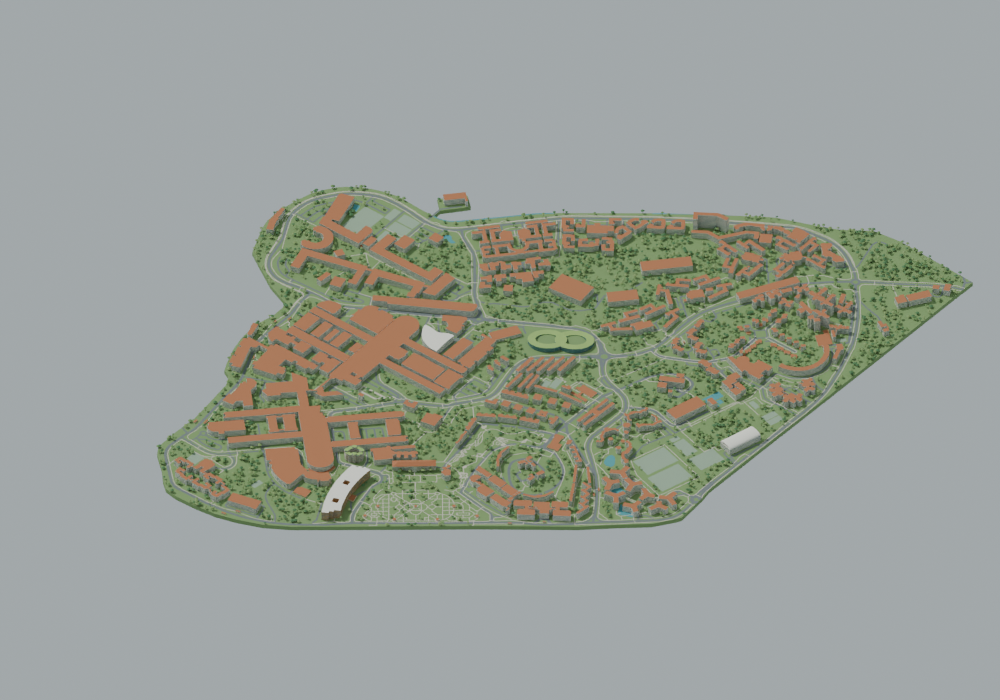

# NTU Yunnan Garden Campus Reconstruction

**Public Community Edition · Manyousang Z / z-hstudio**  
Author: **Ziheng Huang** · 漫游桑 Z / 黄子恒

An approximate visual 3D reconstruction of **Nanyang Technological University, Singapore — Yunnan Garden main campus, including NIE**. Current stable download: [Community v1.0.0](https://github.com/z-hstudio/ntu-campus-reconstruction/releases/tag/community-v1.0.0), based on the verified formal NTU-v002. Three later development snapshots are available separately as historical prereleases; they are PARTIAL, not a completed new formal model.

**Allowed:** non-commercial learning, education, research, display, video, websites, games, VR/AR, modifications, conversions and derivative distribution under the [z-hstudio Campus Model Community License 1.0](LICENSE.md). This is source-available, **not OSI open source**.

**Required visible source credit:**

> Based on the original 3D campus model by Manyousang Z / z-hstudio.

For modified work, also add **Modified by [Name].**  
中文：本作品基于漫游桑 Z（Manyousang Z）/ z-hstudio 制作的原始校园三维模型。修改版另标修改者，详见 [ATTRIBUTION](ATTRIBUTION.md)。

**Commercial use needs separate written permission. Commercial permission does not waive attribution.** Fees, revenue share or a combination are negotiated separately; no default percentage or commercial grant is made here. See [commercial licensing](COMMERCIAL-LICENSE.md).

**Third-party rights:** © OpenStreetMap contributors; OSM-derived database rights stay under ODbL 1.0, including its commercial freedoms. The Community License covers original rights only and does not replace third-party terms. [Notices](THIRD_PARTY_NOTICES.md) · [rights audit](docs/licensing/RIGHTS-AUDIT.md).

**Not survey data.** For visual/creative use; not construction, safety navigation, legal boundaries, a precision digital twin or an official campus model. Heights, facades, roofs, roads and planting include estimates.

This is an independent community reconstruction project. It is not affiliated with, endorsed by, or officially produced by the university. University names, logos and trademarks belong to their respective owners.

## Download and verify

Use [Releases](https://github.com/z-hstudio/ntu-campus-reconstruction/releases), not the automatic Git source ZIP, for `.blend`, `.glb`, the corresponding spatial database and preview assets. No model binaries are stored in normal Git history; no Git LFS setup is required. Download `SHA256SUMS.txt`, `RELEASE-MANIFEST.json` and `LICENSE-AND-NOTICES.zip` with your chosen assets. On macOS/Linux, run `shasum -a 256 -c SHA256SUMS.txt` in the download folder after downloading all listed files.

Blender validation used **5.2.1 LTS**. Open the public BLEND for editable geometry, or import GLB into compatible viewers/engines. Scene custom properties and `Z_HSTUDIO_ATTRIBUTION` retain source credit; visible credits remain required when publishing your own output. GLB contains no textures or tracking scripts.

345 stable building IDs are represented. 346 original polygon parts are not 346 buildings. Terrain is flat and building dimensions are approximate. See [Public Edition limitations](PUBLIC_EDITION_LIMITATIONS.md).

## History and evidence

[Major milestones](HISTORY.md) · [Changelog](CHANGELOG.md) · [Sources](SOURCES.md) · [Rights and provenance](RIGHTS_AND_PROVENANCE.md) · [Contributing](CONTRIBUTING.md) · [Release manifests](manifests/releases/)

Private masters and ongoing development are retained separately. Historical public snapshots intentionally omit source-restricted changes. Public timestamps document actual publication, not invented historical Git commits.
