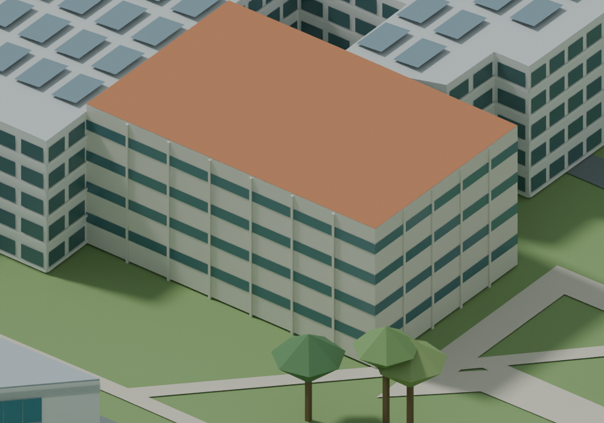
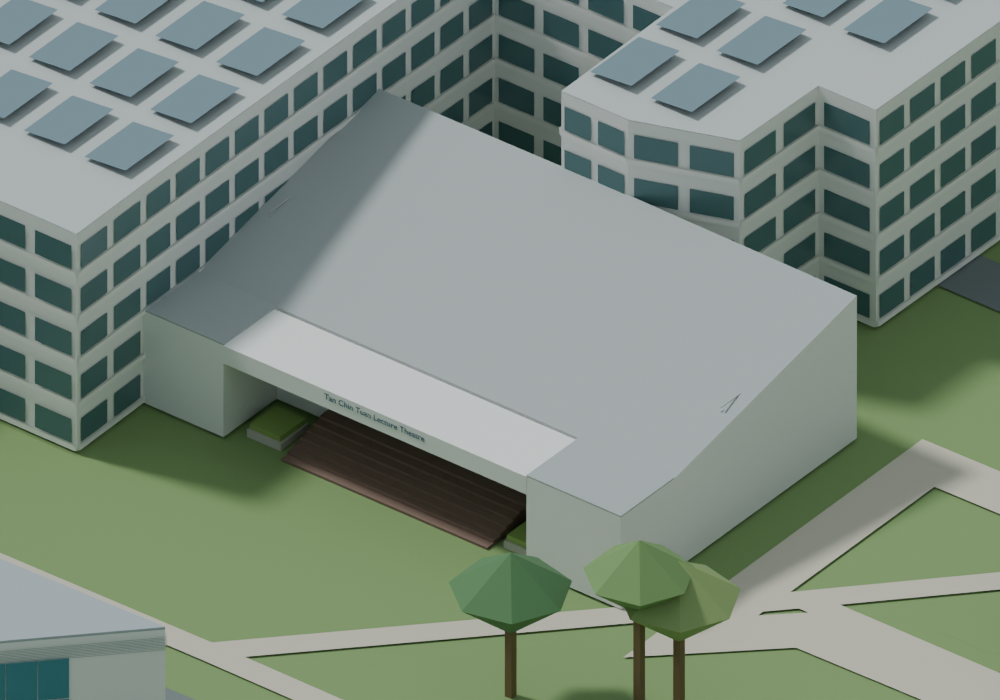

# Teaching and cultural buildings

Internal stage: `NTU-NIGHT8-RSB`. Recorded work date: 2026-09-17. Public tag: `history-night`.

TCT, ASE/N2, UHS, Art Gallery, Playhouse and Nanyang House appearance; N1.3 entrance subset.

Major milestone rationale: this captures a substantive campus-base or multi-building recognition stage, rather than a single checkpoint.

Limitations: Private stage also improved RSB, excluded here pending rights review. N1.3 remains partial; not all campus buildings recognizable.

Public differences: see PUBLIC_EDITION_LIMITATIONS.md. Private acceptance is not claimed for a new full-campus formal release.

Matched before/after relative to preceding public stage:

