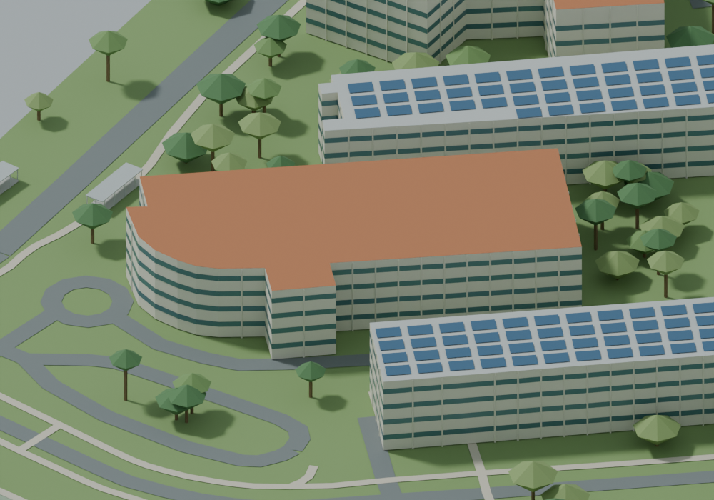
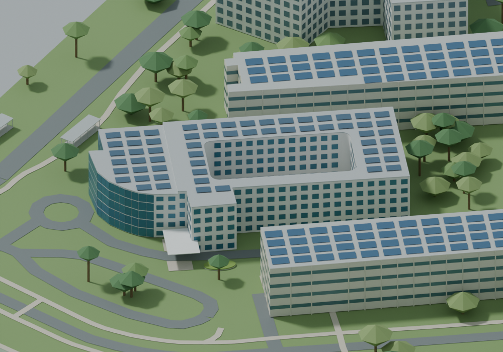

# Six core buildings and entrance context

Internal stage: `NTU-REC1-EMB-fix1`. Recorded work date: 2026-09-16. Public tag: `history-rec1`.

Six core teaching/research/admin buildings gain differentiated appearance; 16 associated entrance/courtyard objects and low planters.

Major milestone rationale: this captures a substantive campus-base or multi-building recognition stage, rather than a single checkpoint.

Limitations: Estimated dimensions; original 30-group unresolved issues persist; whole campus PARTIAL.

Public differences: see PUBLIC_EDITION_LIMITATIONS.md. Private acceptance is not claimed for a new full-campus formal release.

Matched before/after relative to preceding public stage:

