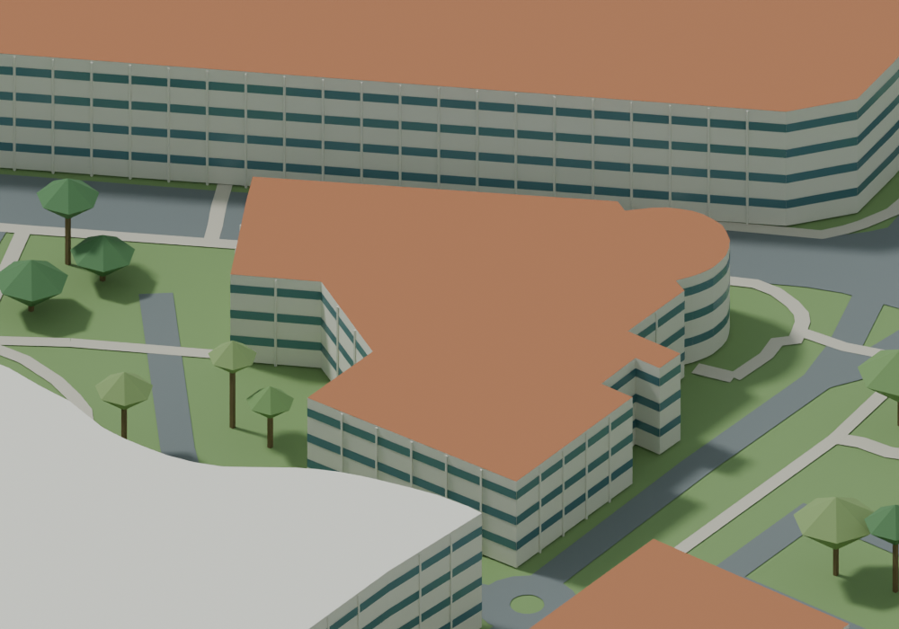
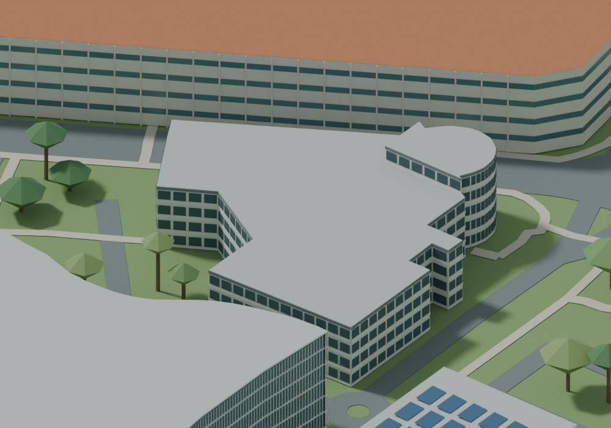

# Four-group appearance correction

Internal stage: `NTU-v012-C01-integrated`. Recorded work date: 2026-09-16. Public tag: `history-v012`.

Integrated NIC appearance, ABN octagonal canopies and old sports-hall roof corrections, preserving the broader earlier 30-group work. Block71 change excluded publicly.

Major milestone rationale: this captures a substantive campus-base or multi-building recognition stage, rather than a single checkpoint.

Limitations: Original 30 groups: 21 necessary corrections complete, 9 PARTIAL; several roofs/heights still unresolved.

Public differences: see PUBLIC_EDITION_LIMITATIONS.md. Private acceptance is not claimed for a new full-campus formal release.

Matched before/after relative to preceding public stage:

